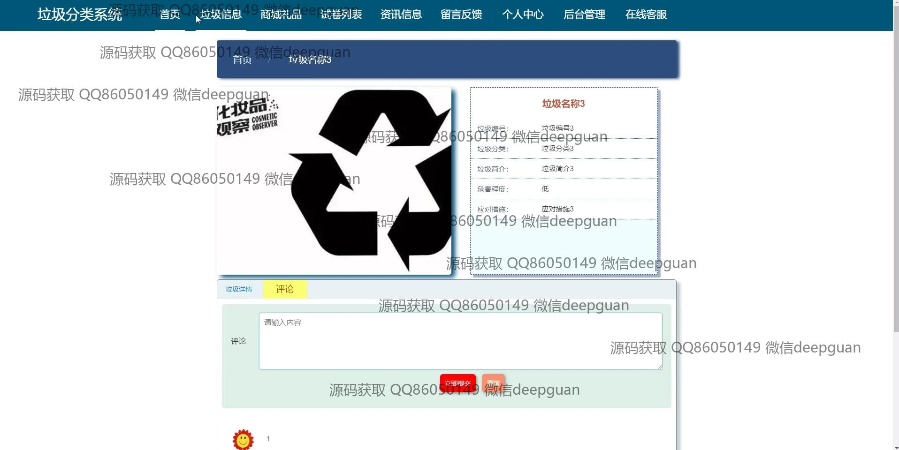
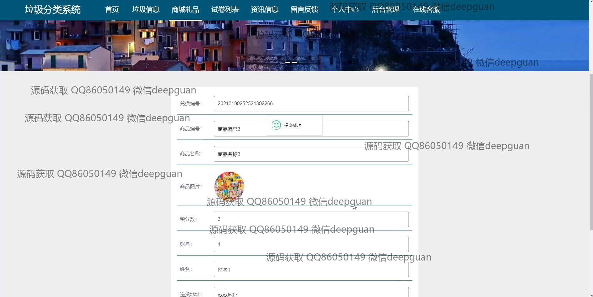
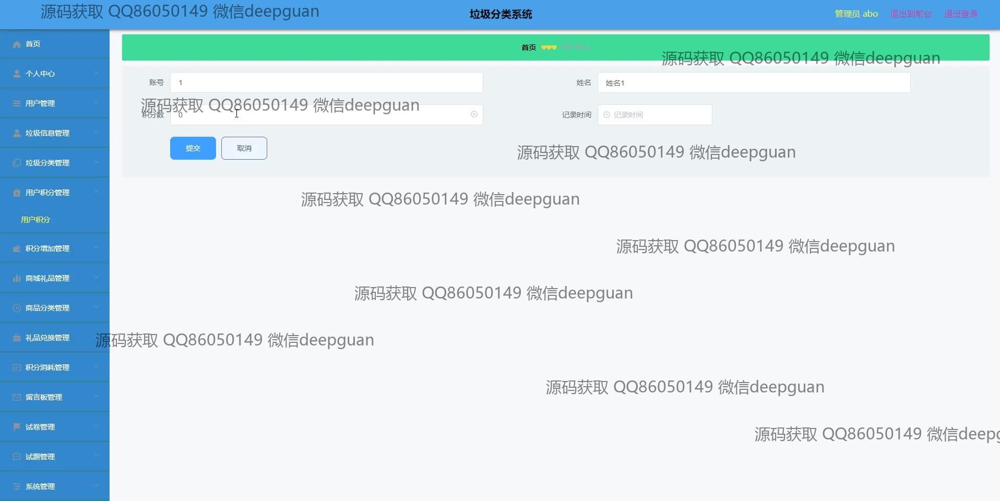

<h1 align="center">的垃圾分类系统vue商城,礼品,考试</h1>

## 简介
垃圾分类系统：角色分为管理员、用户；支持垃圾信息管理、用户积分管理、礼品兑换管理、试卷管理、留言反馈等功能，界面简洁，功能实用。    --计算机毕业设计源码；毕设源码；java毕业设计源码

## 联系方式

<h3 align="center">获取完整代码与数据库文件 + 微信：deepguan QQ: 86050149 QQ群: 783742310</h3>

<h3 align="center">可帮忙远程部署 包运行成功！提供远程部署、修改代码、设计文档指导、代码讲解等服务！</h3>

## 功能介绍（完整见运行截图）
管理员：具备用户管理、垃圾信息管理和积分管理功能，可以通过后台界面修改用户信息，审核和调整用户积分，在管理界面中进行垃圾信息编辑和分类管理，并对商家礼品、考试试卷和留言板进行管理，支持积分功能设定和礼品兑换审核，提供用户评论管理和消息处理窗口，能够创建和管理考试题目，提交或取消更改，功能模块划分清晰，方便系统管理。

用户：可以通过登录界面进入系统，选择垃圾信息、商城礼品和考试模块，参与积分兑换操作，查看和参与考试答题，使用导航栏浏览垃圾分类信息、商品管理和考试试题，参与留言反馈和在线客服交流，查询垃圾属性和管理积分记录，使用分类标签查看不同垃圾信息，支持查询并查看试卷信息和考试记录，通过留言反馈功能提交意见和建议。

## 运行截图

本代码来源于网络,仅供学习参考使用!

